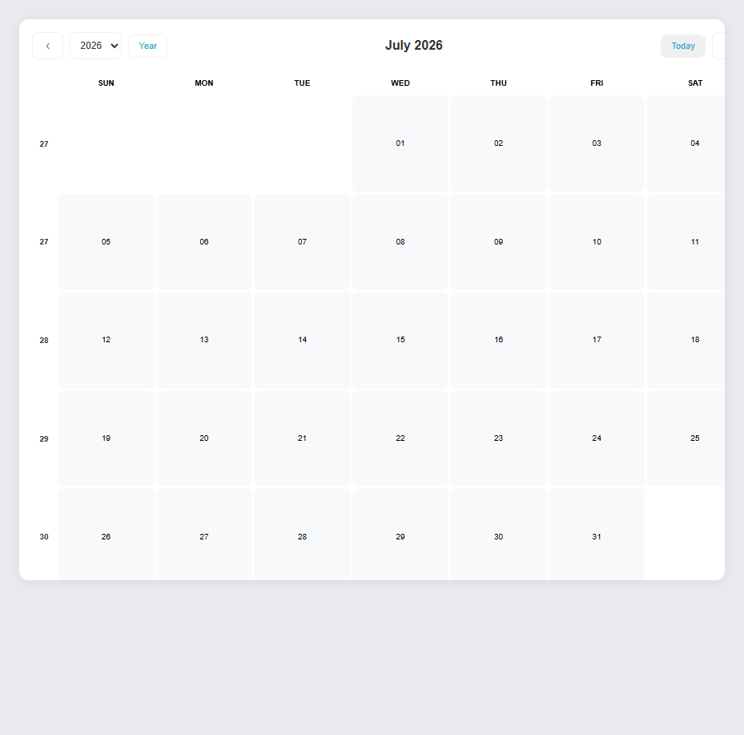
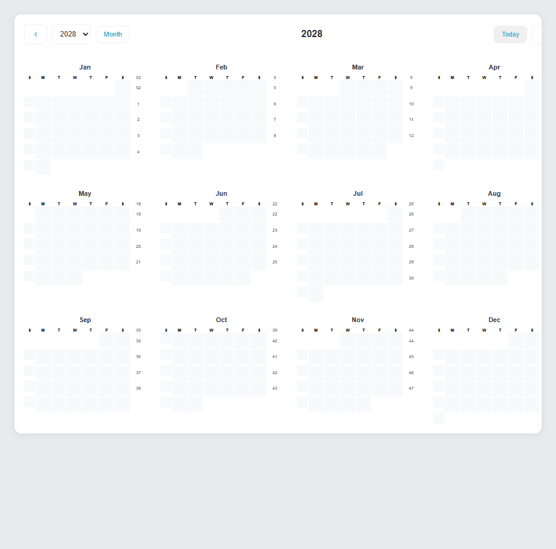
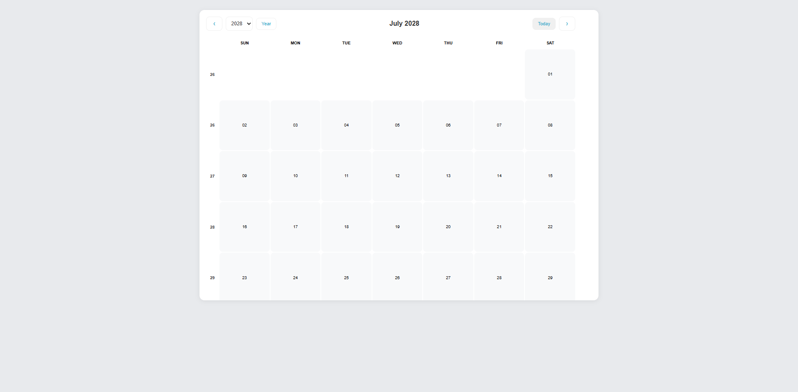

# 📅 Calendar Filter — Superset Chart Plugin

> An interactive, selectable calendar heatmap chart for **Apache Superset 6.1.0** that doubles as a **dashboard cross-filter**. Click dates, filter your dashboard.

[](https://superset.apache.org/)
[](LICENSE)
[](https://github.com/FrancescoCastaldi/superset-plugin-chart-calendar-filter/actions/workflows/ci.yml)


---

<p align="center">
  
</p>

---

## ✨ Features

### Month View — Heatmap at a Glance
Color-coded day cells show metric intensity. Navigate between months, jump to any year, or return to today with one click.

| Control | Description |
|---|---|
| ‹ / › | Previous / Next month |
| Year dropdown | Jump to any year in your data range |
| Today | Return to current month |
| Year / Month | Toggle between month and year overview |

### Year Overview — All 12 Months
See the full year as a 4×3 grid of mini-calendars. Each mini-calendar is interactive — dates are clickable.

<p align="center">
  
</p>

### Interactive Selection & Cross-Filter
- **Single click** — toggle a date on/off
- **Shift-click** — select a contiguous date range
- **Clear all** — reset selection with one button
- **Auto cross-filter** — emits `__time_range IN [...]` to filter all dashboard charts

<p align="center">
  
</p>

### Display Options
| Feature | Description |
|---|---|
| **Color palettes** | 6 palettes: Superset Default, Greens, Blues, Oranges, Reds, Purples |
| **Legend** | Gradient bar with min→max value range |
| **Week numbers** | ISO 8601 week numbers on each week row |
| **First day of week** | Configurable Sunday or Monday start |
| **Rich tooltip** | Hover shows date, metric value, and % of max |
| **Empty state** | Graceful "No data available" message |

---

## 📦 Installation

### Prerequisites
- Apache Superset 6.1.0
- Node.js 16+

### 1. Build the plugin

```bash
cd superset-plugin-chart-calendar-filter
npm install --legacy-peer-deps
npm run build
```

This produces:
- `lib/` — CommonJS
- `esm/` — ES Modules
- TypeScript declarations
- Runs the full test suite (27 tests)

### 2. Link into Superset

From your `superset-frontend/` directory:

```bash
npm i -S ../../superset-plugin-chart-calendar-filter
```

### 3. Register as a visualization

Edit `superset-frontend/src/visualizations/presets/MainPreset.js`:

```js
import { SupersetPluginChartCalendarFilter } from 'superset-plugin-chart-calendar-filter';

// Inside the preset constructor, add:
new SupersetPluginChartCalendarFilter().configure({
  key: 'superset-plugin-chart-calendar-filter',
}),
```

### 4. Restart Superset

Rebuild the frontend and restart the server. The **Calendar Filter** chart will appear in the chart picker.

---

## 🎮 Usage

1. Add a **Calendar Filter** chart to your dashboard
2. Configure the **date column** (e.g. `ds`, `__timestamp`)
3. Select a **metric** to color the calendar cells
4. Apply optional **adhoc filters**
5. Click any date to cross-filter other dashboard charts

### Chart Controls

| Control | Type | Default | Description |
|---|---|---|---|
| `color_scheme` | Select | `supersetColors` | Color palette for heatmap |
| `show_legend` | Checkbox | `true` | Show/hide color legend |
| `show_week_numbers` | Checkbox | `false` | Display ISO week numbers |
| `first_day_of_week` | Select | `0` (Sunday) | Start week on Sunday or Monday |
| `show_year_dropdown` | Checkbox | `true` | Year selector dropdown |
| `enable_overview` | Checkbox | `true` | Year overview toggle |

---

## 🔌 Cross-Filter API

When dates are selected, the plugin emits cross-filters using the `__time_range` column:

```ts
setDataMask({
  extraFormData: {
    filters: [{ col: '__time_range', op: 'IN', val: ['2024-01-01', '2024-01-15'] }],
  },
  filterState: {
    value: ['2024-01-01', '2024-01-15'],
    selectedValues: {
      '2024-01-01': '2024-01-01',
      '2024-01-15': '2024-01-15',
    },
  },
});
```

---

## 🛠 Development

```bash
# Watch mode — rebuilds on every change
npm run dev

# Run tests (27 tests across 4 suites)
npm test

# Full clean build
npm run build-clean
```

### Test Suites

| Suite | File | Tests |
|---|---|---|
| Component | `test/CalendarFilter.test.tsx` | 21 |
| Plugin registration | `test/index.test.ts` | 1 |
| Build query | `test/plugin/buildQuery.test.ts` | 3 |
| Transform props | `test/plugin/transformProps.test.ts` | 2 |

### Quick Demo (standalone)

A self-contained HTML demo is available in the `demo/` directory:

```bash
npx esbuild demo/demo-wrapper.tsx --bundle --global-name=CalendarFilterDemo --outfile=demo/demo-bundle.js --banner:js="var production = true;" --define:process.env.NODE_ENV='"production"' --loader:.js=jsx
# Then serve demo/index.html with any HTTP server
```

---

## 🏗 Project Structure

```
superset-plugin-chart-calendar-filter/
├── src/
│   ├── index.ts                 # Plugin entry point
│   ├── CalendarFilter.tsx        # Main React component
│   ├── types.ts                  # TypeScript interfaces
│   ├── images/thumbnail.png      # Chart picker thumbnail
│   └── plugin/
│       ├── index.ts              # ChartPlugin registration
│       ├── buildQuery.ts         # Query builder
│       ├── controlPanel.ts       # Form controls
│       └── transformProps.ts     # Data transformation
├── test/
│   ├── CalendarFilter.test.tsx   # 21 component tests
│   ├── index.test.ts             # Plugin registration test
│   ├── __mocks__/                # Test mocks
│   └── plugin/                   # Plugin unit tests
├── demo/                         # Standalone demo
│   ├── demo-wrapper.tsx
│   ├── demo-bundle.js
│   ├── index.html
│   └── screenshot*.png           # Demo screenshots
├── types/external.d.ts
├── package.json
├── tsconfig.json
├── babel.config.js
├── jest.config.js
└── AGENTS.md
```

---

## 📄 License

[Apache License 2.0](LICENSE)

---

<p align="center">
  Built for <a href="https://superset.apache.org/">Apache Superset</a>
  ·
  <a href="https://github.com/FrancescoCastaldi/superset-plugin-chart-calendar-filter/issues">Report a bug</a>
  ·
  <a href="https://github.com/FrancescoCastaldi/superset-plugin-chart-calendar-filter/issues">Request a feature</a>
</p>
