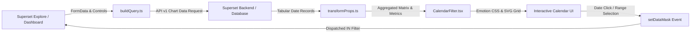

# Calendar Filter - Interactive Heatmap & Native Filter Plugin for Apache Superset

[](https://superset.apache.org/)
[](LICENSE)
[](https://www.typescriptlang.org/)
[](https://reactjs.org/)
[](#)

**Calendar Filter** is an interactive calendar heatmap visualization plugin for **Apache Superset 6.1.0+** engineered for temporal exploratory data analysis. It functions simultaneously as an interactive dashboard visualization, an exploratory cross-filter, and a native dashboard filter component - allowing users to slice and filter companion dashboard charts simply by clicking individual dates or date ranges.

---

## 📸 Visual Preview

### 📊 Dashboard Cross-Filtering in Action


*Figure 1: Calendar Filter integrated into an Apache Superset dashboard, driving cross-filtering across companion analytical charts.*

### 🗓️ Month View & Selection Detail


*Figure 2: Interactive month view showing selected dates, metric intensity color scaling, week numbers, and legend.*

---

## 🌟 Key Features

### 1. 📅 Dual Navigation Modes (Month View & Year Overview)
- **Month View**: Focused single-month calendar with quick navigation (`<` / `>`), year selector dropdown, and one-click return to "Today".
- **Year Overview**: Comprehensive 4x3 grid displaying all 12 mini-calendars simultaneously, providing an executive bird's-eye view of annual trends and distributions.

### 2. 🖱️ Intuitive Interactive Selection
- **Single-Click**: Toggle individual dates on or off.
- **Shift-Click**: Select contiguous date ranges in a single action.
- **Clear All**: Instant reset button to clear active selections and restore baseline dashboard state.
- **Visual Highlight**: Selected dates feature distinct accent borders and state highlights.

### 3. 🔄 Dual Role: Visual Chart & Native Dashboard Filter
- **Standard Chart Mode**: Renders as an informative heatmap chart on any dashboard, emitting `setDataMask` cross-filters when dates are clicked.
- **Native Filter Mode**: Can be embedded into Superset's **Filter Bar** as a native filter component. By configuring the `date_column` control, it targets the dataset's date column (replacing legacy `__timestamp` fallbacks).

### 4. 🎨 Metric-Driven Heatmap & Color Schemes
- **6 Color Palettes**: *Superset Default*, *Greens*, *Blues*, *Oranges*, *Reds*, and *Purples*.
- **Interactive Legend**: Gradient color ramp displaying minimum and maximum threshold values.
- **Calendar Standards**: ISO 8601 week numbers and configurable start of week (Sunday or Monday).
- **Rich Tooltips**: Real-time display of date, metric aggregation, and percentage of period maximum.

---

## 🏛️ Architecture Overview



---

## 📁 Repository Structure

```
superset-plugin-chart-calendar-filter/
├── package.json                    # Plugin manifest & dependencies
├── tsconfig.json                   # TypeScript build settings
├── jest.config.js                  # Jest test configuration
├── installer/
│   ├── install.js                  # Cross-platform Node.js installer
│   ├── install.bat                 # Double-click Windows batch launcher
│   └── INSTALLER.md                # Comprehensive installer documentation
├── docs/
│   ├── INSTALL.md                  # Manual installation instructions
│   └── screenshots/                # High-resolution screenshots & assets
├── src/
│   ├── index.ts                    # Plugin entry point & export
│   ├── CalendarFilter.tsx          # Main React visualization component
│   ├── types.ts                    # TypeScript interfaces & models
│   ├── hooks/
│   │   ├── useCalendarData.ts      # Metric aggregation & date mapping
│   │   ├── useSelectionMask.ts     # Selection state & filter dispatch
│   │   ├── useMacroActions.ts      # One-click macro selections (year/quarter/weekdays)
│   │   ├── useCalendarTooltip.ts   # Tooltip state & viewport positioning
│   │   └── useViewSelection.ts     # Dropdown view changes that propagate the mask
│   ├── plugin/
│   │   ├── index.ts                # ChartPlugin & ChartMetadata registration
│   │   ├── buildQuery.ts           # Query constructor (groupby & metrics)
│   │   ├── controlPanel.ts         # Explore UI controls & native filter options
│   │   └── transformProps.ts       # Data transformation pipeline
│   ├── styles/
│   │   └── CalendarFilter.styles.ts # Emotion styled components
│   ├── utils/
│   │   ├── dateUtils.ts            # Date formatting & range calculations
│   │   └── themeUtils.ts           # Color palettes & base color for heat scale
│   └── images/
│       └── thumbnail.png           # 100x100 chart picker thumbnail
├── test/                           # Comprehensive Jest test suite (70 tests)
└── demo/                           # Standalone browser demo bundle
```

---

## 🚀 Quick Installation in Apache Superset

The repository includes a cross-platform installer that auto-discovers your Superset directory, builds the plugin, links dependencies, and patches `MainPreset`:

### Option 1: Double-Click Batch Launcher (Windows)
Double-click:
👉 **`installer/install.bat`**

### Option 2: Cross-Platform Node.js CLI
```bash
# Auto-detect Superset location:
node installer/install.js

# Or specify your Superset root directory:
node installer/install.js "D:\Sviluppo\superset"
```

The installer autonomously:
1. Locates `superset-frontend/`.
2. Compiles the TypeScript plugin (`npm run build`).
3. Adds `superset-plugin-chart-calendar-filter` into `superset-frontend/package.json`.
4. Idempotently registers `CalendarFilterPlugin` in `MainPreset.ts` with the key `calendar_filter`.
5. Prompts for optional Docker overrides and native filter configurations.

### Option 3: Manual Installation
1. Copy the plugin folder into `superset-frontend/plugins/superset-plugin-chart-calendar-filter`.
2. In `superset-frontend/src/visualizations/presets/MainPreset.ts`:
   ```typescript
   import { CalendarFilterPlugin } from 'superset-plugin-chart-calendar-filter';

   new CalendarFilterPlugin().configure({ key: 'calendar_filter' }),
   ```
3. Clear stale Webpack cache:
   ```bash
   rm -rf superset-frontend/node_modules/.cache
   ```

---

## 🐳 Docker Compose Deployment

```bash
cd /path/to/superset
docker compose -f docker-compose-non-dev.yml up -d --build superset
```

Launch `http://localhost:8088`, create a new chart, and select **Calendar Filter**!

---

## 🎛️ Explore Control Panel Reference

| Control | Section | Type | Default | Description |
|:---|:---|:---|:---|:---|
| `groupby` | Query | Select | Empty | Primary date column to aggregate records and display heatmap intensity. |
| `metric` | Query | Metric | Empty | Quantitative metric displayed in hover tooltips and legend. |
| `date_column` | Native Filter | Select | Empty | Target date column for emitted cross-filters (in **Native Filter Settings**). |
| `color_scheme` | Calendar Options | Select | `supersetColors` | Color palette for heatmap intensity (`greens`, `blues`, `reds`, etc.). |
| `show_legend` | Calendar Options | Checkbox | `true` | Toggles visibility of the min/max gradient legend. |
| `show_week_numbers` | Calendar Options | Checkbox | `false` | Displays ISO 8601 week numbers alongside calendar rows. |
| `first_day_of_week` | Calendar Options | Select | `0` (Sunday) | Configures starting day of the week (Sunday vs. Monday). |
| `show_year_dropdown`| Calendar Options | Checkbox | `true` | Displays year selector dropdown for rapid navigation. |
| `enable_overview` | Calendar Options | Checkbox | `true` | Enables the 4x3 interactive annual overview grid. |
| `cell_density` | Calendar Options | Select | `compact` | Cell spacing density (`compact` or `comfortable`). |

---

## 🔄 Cross-Filter API Payload

When dates are clicked, the plugin dispatches an `IN` operator filter to Superset's `setDataMask` hook:

```typescript
setDataMask({
  extraFormData: {
    filters: [
      {
        col: 'order_date',
        op: 'IN',
        val: ['2026-04-01', '2026-04-15'],
      },
    ],
  },
  filterState: {
    value: ['2026-04-01', '2026-04-15'],
    selectedValues: {
      '2026-04-01': '2026-04-01',
      '2026-04-15': '2026-04-15',
    },
  },
});
```

---

## 🧪 Verification & Test Suite

The plugin features 51 unit tests across 6 comprehensive Jest test suites:

```bash
# Run all unit tests
npm test

# Run tests in watch mode
npm run dev
```

| Test Suite | File | Tests |
|:---|:---|:---|
| **Component Rendering & Interactions** | `test/CalendarFilter.test.tsx` | 27 |
| **Date & Range Utilities** | `test/utils/dateUtils.test.ts` | 11 |
| **Calendar Grid Math** | `test/utils/calendarGrid.test.ts` | 5 |
| **Data Transform Pipeline** | `test/plugin/transformProps.test.ts` | 3 |
| **Query Constructor** | `test/plugin/buildQuery.test.ts` | 1 |
| **Plugin Registration** | `test/index.test.ts` | 1 |
| **Total** | | **51 passing** |

---

## 📄 License

Distributed under the **Apache License 2.0**.
