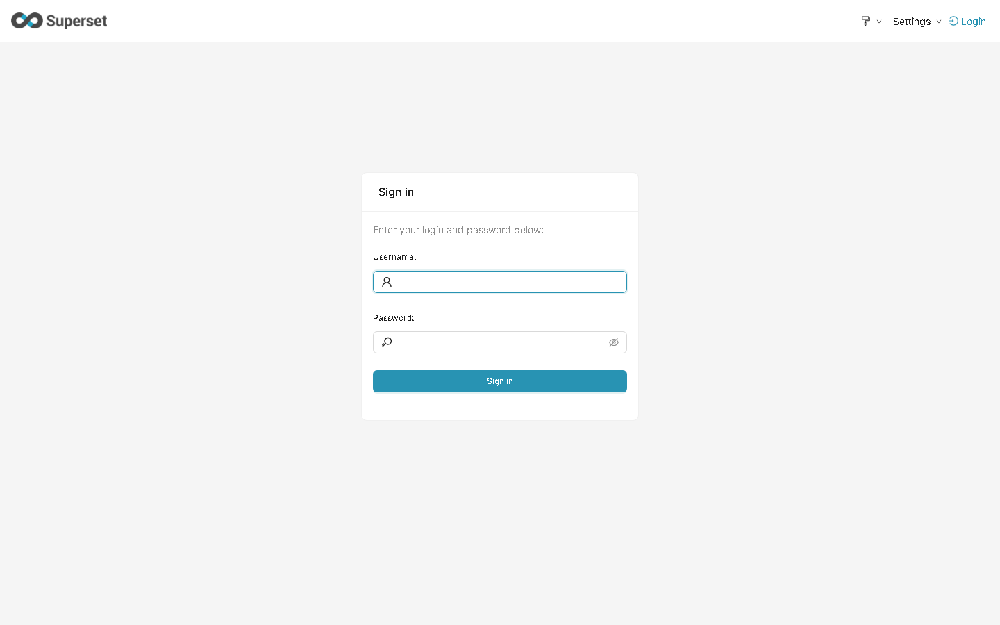
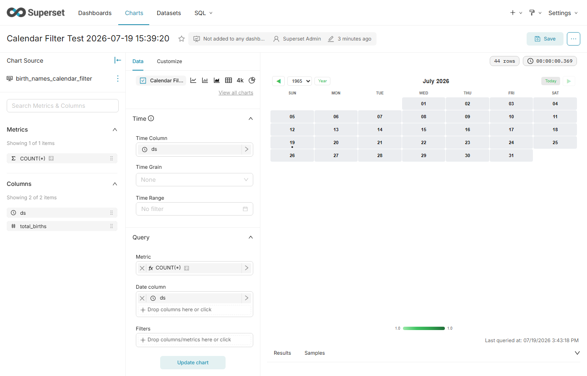
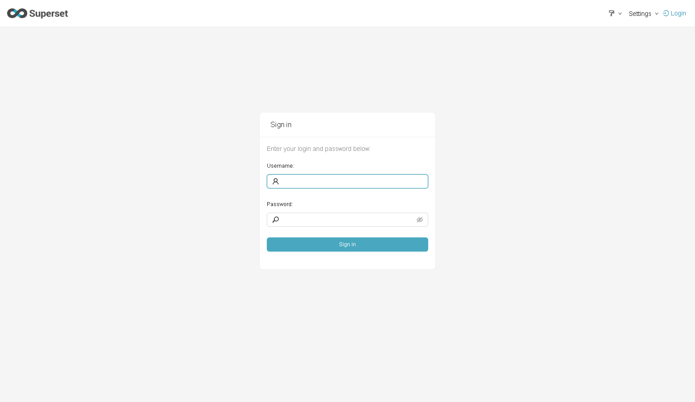

# 📅 Superset Plugin: Calendar Filter Chart & Native Filter

> **Pagina Confluence**: Presentazione e Guida Funzionale del Plugin Calendar Filter per Apache Superset 6.1.0

---

## 🎯 Cos'è il Calendar Filter?

Il plugin **Calendar Filter** (`superset-plugin-chart-calendar-filter`) è un componente di visualizzazione e filtraggio temporale ad alte prestazioni sviluppato per **Apache Superset 6.1.0**. 

È progettato in **Architettura Ibrida Duale** per funzionare in due modalità complementari:
1. **Interactive Dashboard Chart**: integrabile come grafico standard nella griglia della dashboard con supporto Cross-Filtering bidirezionale su tutti gli altri grafici.
2. **Native Filter Bar Component**: inserito direttamente nella barra filtri nativa (pannello laterale sinistro) per controllare l'intero cruscotto analitico.

---

## 🌟 Funzionalità Principali

| Funzionalità | Descrizione |
|---|---|
| 🖥️ **Vista Duale (Mini Inline + Modal)** | Mini calendario compatto a 1 mese per la barra laterale o card ridotte, affiancato dal pulsante **Espandi** per l'apertura di un modal panoramico a 12 mesi. |
| 📅 **Selettore Anno Dinamico** | Controlli di navigazione anno (`◀`, `<select>`, `▶`) integrati nell'header della modale per scorrere ed esplorare liberamente qualsiasi anno (2024, 2025, 2026, 2027, ecc.). |
| 🚀 **Scorciatoie Macro Rapide** | Pulsanti d'azione *1-Click* per selezioni immediate: **🎯 Anno**, **📅 Mese Corrente**, **📊 Q1-Q4**, **💼 Feriali (Lun-Ven)** e **❌ Azzera**. |
| ⚙️ **Formato Filtro Emesso Configurabile** | Supporto per l'emissione sia di intervalli nativi Superset (`time_range`) che di liste discrete di date (clausola SQL `IN ('YYYY-MM-DD', ...)`). |
| ✨ **Design Asettico & Glow Effect** | Fondo celle pulito e neutro (`#ffffff`) per massima leggibilità dei numeri, con evidenziazione grafica al neon e bagliore coordinato per le date selezionate. |
| 🇮🇹 **Localizzazione Italiana Completa** | Interfaccia utente interamente localizzata in italiano (giorni, mesi, pulsanti e tooltip). |

---

## 🖼️ Galleria & Screenshot Reali

### 1. Integrazione nella Sales Dashboard (Native Filter Bar & Chart Slice)
<p align="center">
  
</p>
> *Figura 1: Integrazione del plugin sia come Native Filter Trigger Pill nella barra laterale sinistra che come Chart Slice nella Sales Dashboard.*

---

### 2. Vista Annuale Popover Espansa (12 Mesi con Selettore Anno & Macro)
<p align="center">
  
</p>
> *Figura 2: Finestra modale rettangolare a 12 mesi con Selettore Anno (◀ 2026 ▶), Macro Filtri ed origine posizionata al di sotto dell'header Superset.*

---

### 3. Panoramica Dettagliata Selezione Interattiva
<p align="center">
  
</p>
> *Figura 3: Dettaglio della selezione interattiva sulla griglia dei 12 mesi.*

---

## ⚙️ Come Funziona (Flusso Operativo)

```text
[ Utente Seleziona Date / Macro ]
               │
               ▼
[ CalendarFilter Component ] ───(setDataMask)───► [ Superset Filter Engine ]
                                                          │
                                                          ▼
                                             [ SQL Query Update su Dashboard ]
```

1. **Selezione Interattiva**: L'utente può cliccare una singola data, trascinare un intervallo temporale (click primo giorno ➔ click ultimo giorno) oppure cliccare una Macro (*es. Q1* o *Feriali*).
2. **Propagazione DataMask**: Il plugin notifica lo stato tramite la hook nativa `setDataMask`.
3. **Filtro Sincrono Dashboard**: Apache Superset aggiorna automaticamente le query di tutti i grafici compresi nello scope del filtro.

---

## 📊 Specifiche Tecniche

- **Package**: `superset-plugin-chart-calendar-filter`
- **Compatibilità**: Apache Superset **6.1.0** (Node 18+, React 17, TypeScript 5)
- **Behaviors**: `[Behavior.InteractiveChart, Behavior.NativeFilter]`
- **Licenza**: Apache 2.0
