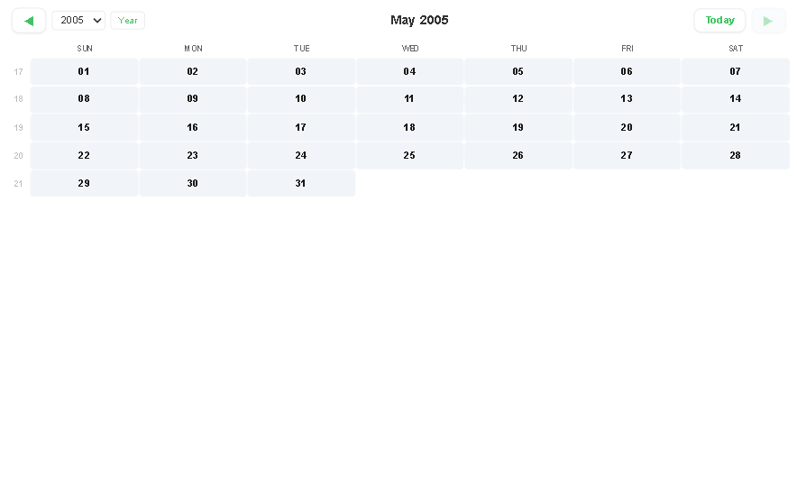
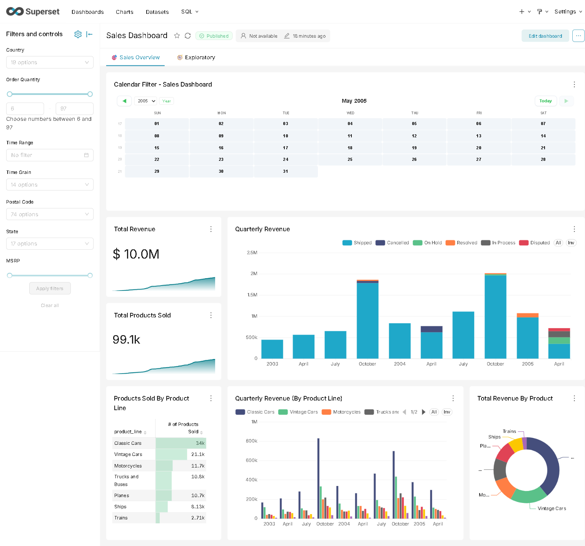
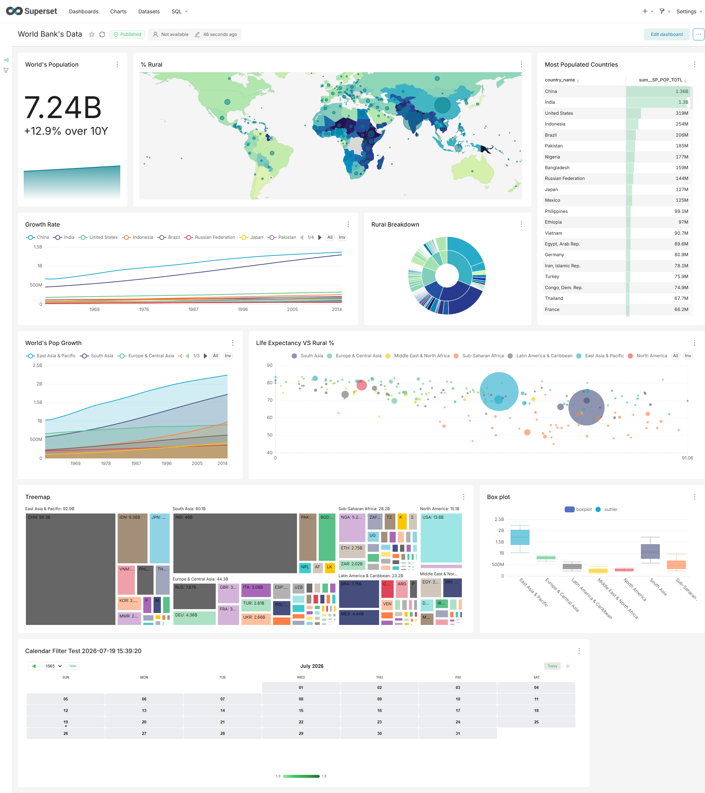
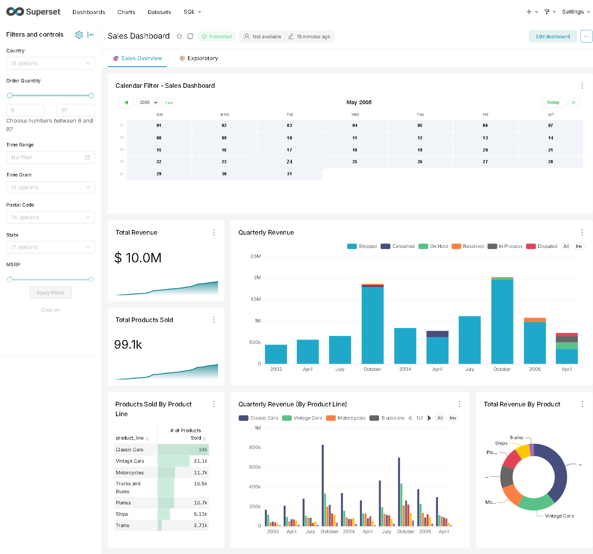
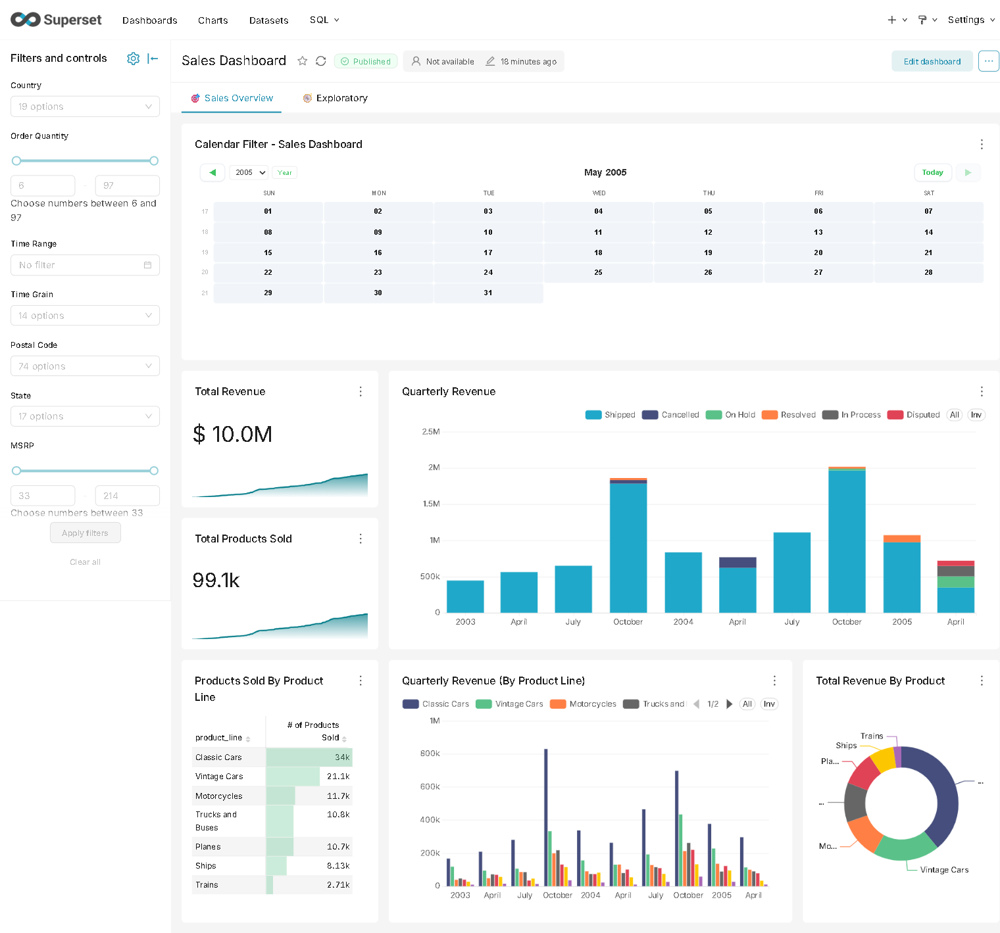
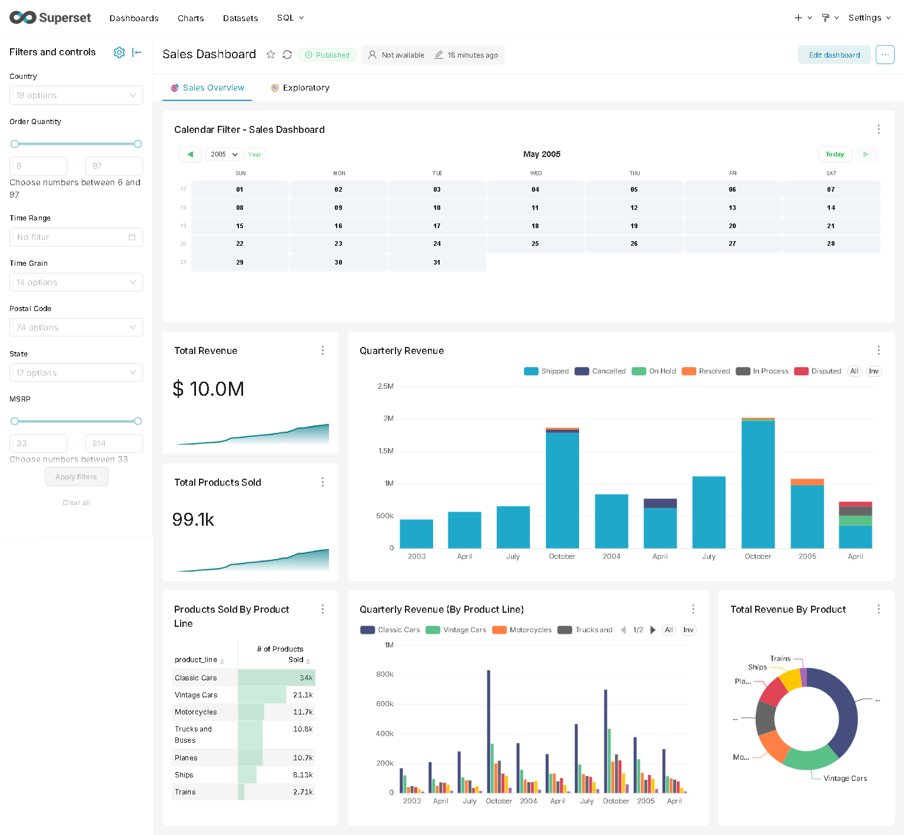

# Test del Calendar Filter Plugin

> Verifica funzionale del plugin `superset-plugin-chart-calendar-filter` per Apache Superset 6.1.0

---

## Introduzione

Questa cartella contiene il materiale di test per il **Calendar Filter Plugin**, un chart plugin per Apache Superset che visualizza un calendario interattivo (heatmap) utilizzabile come filtro incrociato (cross-filter) nelle dashboard.

Il plugin permette di:
- Visualizzare dati temporali su una griglia calendario mensile/annuale
- Selezionare singoli giorni o range di date con click
- Filtrare automaticamente tutti gli altri chart della dashboard collegati
- Navigare tra mesi e anni con controlli compatti

---

## Configurazione del Chart

| Parametro | Valore |
|---|---|
| **Chart type** | Calendar Filter |
| **Viz type** | `superset-plugin-chart-calendar-filter` |
| **Metric** | `COUNT(*)` o metrica personalizzata |
| **Date column** | Colonna data del dataset |
| **Time range** | No filter |

---

## Test in Explore

Una volta configurato il chart, verificare che:

- La griglia calendario venga renderizzata correttamente
- I colori della heatmap riflettano l'intensità dei dati
- I controlli di navigazione (mese/anno) siano visibili e funzionanti
- L'indicatore del giorno corrente sia evidenziato
- La legenda gradient mostri i valori min/max

---

## Test su Dashboard (Sales Dashboard)

Il chart Calendar Filter è stato integrato nella **Sales Dashboard** con cross-filter globale, permettendo di filtrare tutti i chart della dashboard selezionando date sul calendario.

La dashboard mostra diversi tipi di chart che reagiscono alla selezione:
- **Total Revenue** e **Total Products Sold** (big number)
- **Quarterly Revenue** (time series)
- **Products Sold By Product Line** (table)
- **Quarterly Revenue (By Product Line)** e **Total Revenue By Product** (bar chart)

---

## Funzionalità Testate

| Funzionalità | Stato | Note |
|---|---|---|
| Rendering calendar heatmap | ✅ | Colori GitHub-style |
| Navigazione mesi (◀ ▶) | ✅ | Pulsanti compatti |
| Navigazione anni | ✅ | Selettore anno con frecce |
| Indicatore giorno corrente | ✅ | Evidenziato con bordo |
| Selezione singolo giorno | ✅ | Click per selezionare/deselezionare |
| Badge selezione | ✅ | Mostra conteggio giorni selezionati |
| Year/Month toggle | ✅ | Vista anno con 4x3 mini-calendari |
| Cross-filter dashboard | ✅ | Scope globale |
| Modalità compact | ✅ | Opzione Cell Density |
| Palette colori multiple | ✅ | 6 palette disponibili |

---

## Test Interattivo del Cross-Filter

### Configurazione

Il chart calendar-filter è stato aggiunto alla **Sales Dashboard** (id:5):

| Impostazione | Valore |
|---|---|
| **Dashboard** | Sales Dashboard (id:5) |
| **Cross-filter** | Abilitato, scope globale |
| **Dataset** | Dataset condiviso tra i chart |

### Selezione Singolo Giorno

Clicca su un giorno nel calendario per selezionarlo:

- Il giorno viene evidenziato con un bordo
- Il badge di selezione appare mostrando i giorni selezionati
- Tutti gli altri chart della dashboard vengono filtrati per quella data

### Selezione Multipla (click multipli)

Per selezionare più giorni:

1. Clicca su un giorno per selezionarlo
2. Clicca su altri giorni per aggiungerli alla selezione
3. Ogni giorno selezionato viene evidenziato
4. Il badge mostra il numero di giorni selezionati

### Cross-Filter Attivo sulla Dashboard

Quando selezioni dei giorni nel calendario:

- Tutti gli altri chart della dashboard vengono filtrati automaticamente
- Il badge mostra il numero di giorni selezionati
- Per deselezionare, clicca su **Clear** nel badge o clicca di nuovo sul giorno
- La dashboard si aggiorna in tempo reale mostrando solo i dati del periodo selezionato

### Casi d'Uso

| Scenario | Descrizione |
|---|---|
| **Analisi mensile** | Seleziona giorni specifici per vedere trend |
| **Analisi outlier** | Seleziona giorni specifici per analizzare picchi o anomalie |
| **Confronto periodi** | Naviga tra mesi/anni per confrontare periodi diversi |
| **Filtro rapido** | Usa il calendario come filtro visivo per esplorare i dati temporali |

---

## Note

- Il plugin richiede che la colonna data sia di tipo DATE o TIMESTAMP.
- Il cross-filter funziona solo con chart nella stessa dashboard e con scope di filtro compatibile.
- Per il test in modalità standalone (senza Superset), utilizzare la demo inclusa nella cartella `demo/` del plugin.
